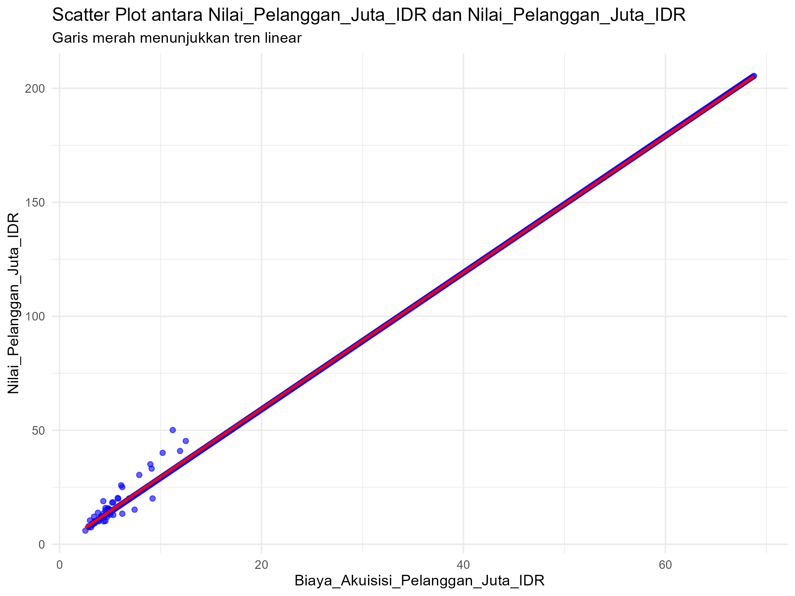
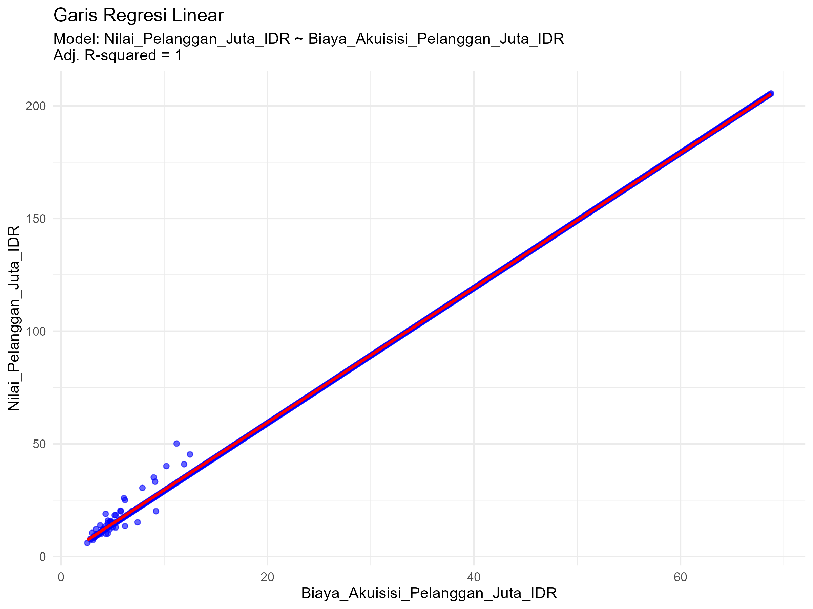

# Tugas Analisis Statistik: Deskriptif, Korelasi, dan Regresi

## 1. Informasi Penyusun

- **Nama:** `[NAMA LENGKAP MAHASISWA]`
- **NIM:** `[NOMOR INDUK MAHASISWA]`
- **Program Studi:** `[PROGRAM STUDI]`
- **Mata Kuliah:** Statistika dan Probabilitas

---

## 2. Deskripsi Proyek

Dataset yang digunakan dalam analisis ini merupakan data perusahaan yang berisi informasi mengenai Biaya_Akuisisi_Pelanggan_Juta_IDR dan Nilai_Pelanggan_Juta_IDR. Variabel Biaya_Akuisisi_Pelanggan_Juta_IDR merepresentasikan besarnya biaya yang dikeluarkan perusahaan untuk memperoleh pelanggan dalam satuan juta rupiah, sedangkan Nilai_Pelanggan_Juta_IDR menggambarkan nilai ekonomi pelanggan yang dihasilkan dalam satuan juta rupiah.

Tujuan dari analisis ini adalah untuk memahami karakteristik data melalui analisis statistik deskriptif, menguji pola distribusi data melalui uji normalitas, menganalisis hubungan antara biaya akuisisi pelanggan dan nilai pelanggan melalui analisis korelasi, serta membangun model regresi linear untuk menjelaskan dan memprediksi nilai pelanggan berdasarkan biaya akuisisi pelanggan yang dikeluarkan perusahaan.
---

## 3. Struktur Proyek

Proyek ini diorganisir ke dalam beberapa folder:
- `/data`: Berisi dataset mentah yang digunakan untuk analisis.
- `/scripts`: Berisi semua skrip R yang digunakan dalam analisis, diurutkan berdasarkan alur kerja.
- `/results`: Berisi output dari analisis, seperti plot, gambar, atau tabel ringkasan.

---

## 4. Cara Menjalankan Analisis

Untuk mereproduksi hasil analisis ini, ikuti langkah-langkah berikut:
1. Pastikan Anda memiliki R dan RStudio terinstal.
2. Buka proyek R ini di RStudio.
3. Instal paket yang diperlukan dengan menjalankan perintah berikut di konsol R:
   ```R
   # install.packages(c("tidyverse", "corrplot", "knitr"))
   ```
4. Jalankan skrip di dalam folder `/scripts` secara berurutan, mulai dari `01_data_preparation.R` hingga `05_analisis_regresi.R`.

---

## 5. Hasil dan Interpretasi

Di bagian ini, mahasiswa diharapkan untuk menyajikan dan menginterpretasikan hasil dari setiap tahap analisis.

### 5.1. Statistik Deskriptif
5.1. Statistik Deskriptif
Ukuran Pemusatan (Mean, Median, Modus)

Ringkasan Nilai:

Berdasarkan hasil analisis statistik deskriptif pada variabel Biaya_Akuisisi_Pelanggan_Juta_IDR, diperoleh nilai mean (rata-rata) sebesar 33,50 juta IDR, median sebesar 33,08 juta IDR, dan modus sebesar 3,21 juta IDR. Nilai mean dan median yang sangat berdekatan menunjukkan bahwa pusat distribusi data berada pada kisaran yang relatif sama, sehingga distribusi data tidak mengalami kemencengan (skewness) yang ekstrem. Sementara itu, nilai modus yang jauh lebih kecil dibandingkan mean dan median mengindikasikan bahwa terdapat sejumlah observasi dengan biaya akuisisi pelanggan yang rendah dan sering muncul dalam dataset.

Interpretasi:

Nilai mean sebesar 33,50 juta IDR menunjukkan rata-rata biaya yang dikeluarkan perusahaan untuk memperoleh satu pelanggan. Median sebesar 33,08 juta IDR yang hampir sama dengan nilai mean mengindikasikan bahwa sebagian besar data tersebar secara relatif seimbang di sekitar nilai pusat tersebut. Kedekatan antara mean dan median menandakan bahwa distribusi biaya akuisisi pelanggan tidak condong secara ekstrem ke kiri maupun ke kanan.

Namun demikian, nilai modus sebesar 3,21 juta IDR menunjukkan bahwa nilai biaya akuisisi pelanggan yang paling sering muncul berada jauh di bawah nilai rata-rata. Hal ini mengindikasikan bahwa terdapat kelompok perusahaan yang mampu memperoleh pelanggan dengan biaya relatif rendah, meskipun secara keseluruhan rata-rata biaya akuisisi tergolong cukup tinggi. Perbedaan yang cukup besar antara nilai modus dan nilai mean mencerminkan adanya variasi biaya akuisisi pelanggan antar perusahaan dalam dataset.

Secara keseluruhan, ukuran pemusatan menunjukkan bahwa pusat distribusi data berada di kisaran 33 juta IDR, tetapi tetap terdapat dominasi nilai biaya rendah yang sering muncul, sehingga struktur data bersifat heterogen.

Ukuran Sebaran (Standar Deviasi, Range, Kuartil)

**Ringkasan Ukuran Sebaran:**

Hasil analisis ukuran sebaran pada variabel Biaya_Akuisisi_Pelanggan_Juta_IDR menunjukkan bahwa nilai minimum sebesar 2,56 juta IDR dan nilai maksimum sebesar 68,77 juta IDR. Dengan demikian, range (rentang) data adalah 66,21 juta IDR, yang menunjukkan perbedaan biaya akuisisi pelanggan yang sangat besar antar perusahaan. Nilai standar deviasi sebesar 20,03 juta IDR menandakan tingkat penyebaran data yang cukup tinggi dari nilai rata-rata.

Berdasarkan ringkasan lima angka (five-number summary), diperoleh nilai Kuartil 1 (Q1) sebesar 15,23 juta IDR, median sebesar 33,08 juta IDR, dan Kuartil 3 (Q3) sebesar 50,92 juta IDR.

**Interpretasi:**

Nilai standar deviasi sebesar 20,03 juta IDR menunjukkan bahwa biaya akuisisi pelanggan menyebar cukup jauh dari nilai rata-rata sebesar 33,50 juta IDR. Hal ini mengindikasikan bahwa biaya yang dikeluarkan perusahaan untuk memperoleh pelanggan tidak terkonsentrasi pada satu nilai tertentu, melainkan sangat bervariasi.

Nilai range yang sangat lebar, yaitu dari 2,56 hingga 68,77 juta IDR, menunjukkan adanya perbedaan yang signifikan antara perusahaan dengan biaya akuisisi pelanggan rendah dan perusahaan dengan biaya akuisisi pelanggan tinggi. Perusahaan dengan biaya terendah kemungkinan memiliki strategi pemasaran yang lebih efisien, sedangkan perusahaan dengan biaya tertinggi mungkin menghadapi persaingan pasar yang lebih ketat atau menggunakan strategi promosi yang lebih mahal.

Berdasarkan kuartil, sebanyak 25% data berada di bawah 15,23 juta IDR, yang menunjukkan kelompok perusahaan dengan biaya akuisisi pelanggan relatif rendah. Sementara itu, 25% data lainnya berada di atas 50,92 juta IDR, yang menandakan adanya kelompok perusahaan dengan biaya akuisisi pelanggan yang tinggi. Median sebesar 33,08 juta IDR menunjukkan bahwa setengah dari perusahaan memiliki biaya akuisisi di bawah nilai tersebut dan setengah lainnya berada di atasnya.

**Visualisasi Data (Histogram)**


Interpretasi Histogram Biaya_Akuisisi_Pelanggan_Juta_IDR

Histogram dab Boxplot Biaya_Akuisisi_Pelanggan_Juta_IDR menunjukkan bahwa data biaya akuisisi pelanggan tersebar dalam rentang yang cukup luas, yaitu dari sekitar 2,56 juta IDR hingga 68,77 juta IDR. Sebaran batang histogram terlihat relatif merata di sepanjang rentang nilai, namun tetap menunjukkan variasi frekuensi pada beberapa interval tertentu.

Garis merah putus-putus pada histogram menandai nilai mean sebesar 33,5 juta IDR, yang berada di sekitar bagian tengah distribusi. Posisi mean yang berada di pusat sebaran menunjukkan bahwa secara umum biaya akuisisi pelanggan rata-rata berada pada kisaran menengah, tidak terlalu rendah maupun terlalu tinggi.

Pada bagian kiri histogram (nilai rendah), terlihat adanya sejumlah frekuensi pada biaya akuisisi yang relatif kecil. Hal ini sejalan dengan nilai modus sebesar 3,21 juta IDR, yang menunjukkan bahwa biaya akuisisi pelanggan yang paling sering muncul berada pada tingkat yang rendah. Kondisi ini mengindikasikan bahwa terdapat kelompok perusahaan yang mampu memperoleh pelanggan dengan biaya yang relatif efisien.

Sementara itu, pada bagian kanan histogram juga terlihat sebaran data hingga nilai yang cukup tinggi. Keberadaan nilai-nilai tinggi ini menunjukkan adanya perusahaan dengan biaya akuisisi pelanggan yang besar, yang kemungkinan disebabkan oleh strategi pemasaran yang agresif, biaya promosi yang tinggi, atau tingkat persaingan pasar yang ketat. Nilai-nilai tinggi tersebut turut berkontribusi terhadap besarnya standar deviasi dan range data.

Secara keseluruhan, pola histogram menunjukkan bahwa distribusi Biaya_Akuisisi_Pelanggan_Juta_IDR memiliki tingkat variasi yang tinggi dan tidak sepenuhnya terpusat pada satu rentang nilai tertentu. Meskipun nilai mean dan median hampir sama, keberadaan nilai rendah yang sering muncul serta nilai tinggi yang cukup ekstrem menunjukkan bahwa struktur data bersifat heterogen. Oleh karena itu, untuk memahami karakteristik biaya akuisisi pelanggan secara lebih komprehensif, analisis tidak cukup hanya mengandalkan nilai rata-rata, tetapi juga perlu mempertimbangkan ukuran sebaran dan visualisasi data.
Kesimpulan

Berdasarkan analisis statistik deskriptif, variabel Biaya_Akuisisi_Pelanggan_Juta_IDR memiliki tingkat variasi yang tinggi. Hal ini ditunjukkan oleh standar deviasi yang besar, range yang sangat lebar, serta perbedaan yang jelas antar kelompok perusahaan berdasarkan kuartil. Meskipun nilai mean dan median yang hampir sama menunjukkan bahwa pusat distribusi data relatif seimbang, nilai modus yang jauh lebih rendah mengindikasikan adanya kelompok perusahaan dengan biaya akuisisi pelanggan yang rendah dan sering muncul dalam data.

Secara keseluruhan, data biaya akuisisi pelanggan tidak terpusat pada satu nilai tertentu, melainkan tersebar luas dari biaya yang sangat rendah hingga sangat tinggi. Kondisi ini menunjukkan adanya perbedaan strategi dan efisiensi akuisisi pelanggan antar perusahaan dalam dataset yang dianalisis.

### 5.2. Uji Normalitas
- **Hasil Uji Shapiro-Wilk:**
**Hasil Uji Shapiro–Wilk**

Berdasarkan uji normalitas Shapiro–Wilk terhadap variabel Biaya_Akuisisi_Pelanggan_Juta_IDR, diperoleh nilai statistik uji W = 0,94291 dengan p-value = 4,138 × 10⁻¹⁵. Nilai p-value tersebut jauh lebih kecil dari tingkat signifikansi 0,05.

**Interpretasi:**

Karena nilai p-value < 0,05, maka hipotesis nol (H₀) yang menyatakan bahwa data berdistribusi normal ditolak. Hal ini menunjukkan bahwa secara statistik, sebaran data Biaya_Akuisisi_Pelanggan_Juta_IDR tidak mengikuti distribusi normal. Ketidaknormalan distribusi ini mengindikasikan bahwa data memiliki pola sebaran yang tidak simetris dan kemungkinan dipengaruhi oleh nilai-nilai ekstrem pada beberapa observasi.

Dalam konteks biaya akuisisi pelanggan, kondisi ini dapat terjadi karena perbedaan strategi pemasaran dan tingkat efisiensi antar perusahaan. Sebagian perusahaan mungkin mampu memperoleh pelanggan dengan biaya relatif rendah, sementara perusahaan lain harus mengeluarkan biaya yang jauh lebih besar akibat persaingan pasar, intensitas promosi, atau karakteristik segmen pelanggan yang berbeda. Variasi inilah yang menyebabkan distribusi data menyimpang dari pola normal.
- **Plot Q-Q:**
  
  - *Interpretasi:* Apakah titik-titik data mengikuti garis lurus? Apa artinya?

Berdasarkan Q-Q Plot variabel Biaya_Akuisisi_Pelanggan_Juta_IDR, terlihat bahwa titik-titik data tidak mengikuti garis diagonal secara konsisten. Pada bagian tengah, beberapa titik masih mendekati garis normal teoritis, namun pada kuantil rendah dan kuantil tinggi terjadi penyimpangan yang jelas. Pola lengkungan ini menunjukkan bahwa distribusi data tidak simetris dan dipengaruhi oleh nilai-nilai ekstrem, khususnya pada biaya akuisisi pelanggan yang tinggi. Temuan ini memperkuat hasil uji Shapiro–Wilk yang menyatakan bahwa data Biaya_Akuisisi_Pelanggan_Juta_IDR tidak berdistribusi normal.

Penyimpangan pada bagian ekor distribusi menunjukkan adanya variasi biaya akuisisi pelanggan yang cukup besarzikareta antar perusahaan. Sebagian perusahaan mampu memperoleh pelanggan dengan biaya relatif rendah, sementara perusahaan lain harus mengeluarkan biaya yang jauh lebih tinggi akibat perbedaan strategi pemasaran dan tingkat persaingan. Kondisi ini menyebabkan distribusi data menjadi tidak normal dan menegaskan bahwa penggunaan ukuran sebaran serta metode analisis non-parametrik perlu dipertimbangkan pada tahap analisis selanjutnya.
### 5.3. Analisis Korelasi
- **Nilai Koefisien Korelasi:**
  - *Nilai r...*
  - Nilai r = 0,9997703

**Interpretasi:**
Nilai koefisien korelasi (r) sebesar 0,9997703 menunjukkan adanya korelasi positif yang sangat kuat antara Biaya_Akuisisi_Pelanggan_Juta_IDR dan Nilai_Pelanggan_Juta_IDR. Arah hubungan yang positif berarti bahwa semakin tinggi biaya akuisisi pelanggan, maka semakin tinggi pula nilai pelanggan yang dihasilkan. Besarnya nilai r yang mendekati 1 menunjukkan bahwa hubungan antara kedua variabel bersifat hampir linear sempurna dan sangat konsisten di seluruh data.

- **Visualisasi (Scatter Plot):**
  
  - *Interpretasi:* Apakah pola pada scatter plot mendukung hasil koefisien korelasi?

Ya, pola pada scatter plot sangat mendukung hasil koefisien korelasi. Scatter plot menunjukkan titik-titik data yang tersebar rapat dan membentuk pola linear positif yang jelas, sejalan dengan nilai koefisien korelasi r = 0,9997703 yang menandakan korelasi positif sangat kuat. Konsistensi sebaran titik di sepanjang garis tren menunjukkan bahwa hubungan antara kedua variabel tidak hanya kuat secara statistik, tetapi juga tampak jelas secara visual.

scatter plot antara Biaya_Akuisisi_Pelanggan_Juta_IDR dan Nilai_Pelanggan_Juta_IDR menunjukkan adanya pola hubungan linear positif yang sangat jelas. Titik-titik data tersebar rapat dan membentuk garis lurus yang menanjak, yang mengindikasikan bahwa semakin besar biaya yang dikeluarkan untuk akuisisi pelanggan, semakin besar pula nilai pelanggan yang dihasilkan. Kerapatan titik di sekitar garis tren menunjukkan bahwa hubungan antara kedua variabel bersifat sangat kuat dan konsisten.

Selain itu, hampir tidak terlihat penyimpangan ekstrem atau pola non-linear pada sebaran data. Hal ini menunjukkan bahwa hubungan antara biaya akuisisi pelanggan dan nilai pelanggan bersifat stabil di seluruh rentang data yang dianalisis. Pola scatter plot ini secara visual memperkuat hasil uji korelasi Pearson yang menunjukkan adanya korelasi positif yang sangat kuat dan signifikan secara statistik antara kedua variabel.
### 5.4. Analisis Regresi
-5.4. Analisis Regresi

Analisis regresi linear dilakukan untuk mengetahui pengaruh Biaya_Akuisisi_Pelanggan_Juta_IDR terhadap Nilai_Pelanggan_Juta_IDR, serta untuk membangun model prediktif yang menjelaskan hubungan kuantitatif antara kedua variabel tersebut.

Model Regresi

Persamaan Regresi:

𝑌=𝑏0+𝑏1𝑋Y=b0+b1X

Berdasarkan hasil analisis regresi linear, diperoleh persamaan model sebagai berikut:

Nilai_Pelanggan_Juta_IDR=0,38+2,99×
Biaya_Akuisisi_Pelanggan_Juta_IDR
Nilai_Pelanggan_Juta_IDR=−0,38+2,99×Biaya_Akuisisi_Pelanggan_Juta_IDR

Interpretasi Koefisien:

Nilai intercept (b₀) sebesar -0,38 menunjukkan nilai prediksi Nilai_Pelanggan_Juta_IDR ketika Biaya_Akuisisi_Pelanggan_Juta_IDR bernilai 0. Secara matematis, intercept berfungsi sebagai titik awal model regresi. Namun, dalam konteks nyata, nilai ini tidak selalu memiliki makna praktis karena biaya akuisisi pelanggan bernilai nol jarang terjadi.

Nilai slope (b₁) sebesar 2,99 menunjukkan bahwa setiap kenaikan 1 juta IDR biaya akuisisi pelanggan akan meningkatkan nilai pelanggan sebesar rata-rata 2,99 juta IDR. Koefisien slope yang bernilai positif menandakan adanya hubungan searah, di mana peningkatan biaya akuisisi pelanggan diikuti oleh peningkatan nilai pelanggan.

Evaluasi Model (R-squared)

Nilai R-squared (Adjusted R-squared) = 0,9995 atau 99,95%

Interpretasi:

Nilai Adjusted R-squared sebesar 0,9995 menunjukkan bahwa sekitar 99,95% variasi pada variabel Nilai_Pelanggan_Juta_IDR dapat dijelaskan oleh variabel Biaya_Akuisisi_Pelanggan_Juta_IDR melalui model regresi ini. Hal ini menandakan bahwa model memiliki daya jelaskan yang sangat tinggi, dan hanya sekitar 0,05% variasi data yang dipengaruhi oleh faktor lain di luar model.

Tingginya nilai R-squared ini menunjukkan bahwa hubungan antara kedua variabel sangat kuat dan hampir seluruh perubahan nilai pelanggan dapat diterangkan oleh perubahan biaya akuisisi pelanggan.
- **Visualisasi (Garis Regresi pada Scatter Plot):**
  -   
  - *Interpretasi:* Jelaskan bagaimana garis regresi merepresentasikan hubungan antara variabel.

Garis regresi yang menanjak pada grafik menunjukkan adanya hubungan linear positif antara Biaya_Akuisisi_Pelanggan_Juta_IDR dan Nilai_Pelanggan_Juta_IDR. Artinya, semakin besar biaya yang dikeluarkan untuk mengakuisisi pelanggan, maka nilai pelanggan yang dihasilkan juga cenderung semakin tinggi. Pola ini terlihat jelas karena titik-titik data mengikuti arah garis regresi dengan penyebaran yang relatif kecil.

Selain itu, kedekatan hampir seluruh titik data terhadap garis regresi menunjukkan bahwa model mampu merepresentasikan hubungan kedua variabel dengan sangat baik. Hal ini sejalan dengan nilai Adjusted R-squared yang mendekati 1, yang menandakan bahwa variasi nilai pelanggan hampir seluruhnya dapat dijelaskan oleh biaya akuisisi pelanggan dalam model regresi ini.
---

## 6. Kesimpulan

Berdasarkan seluruh rangkaian analisis yang dilakukan, dapat disimpulkan bahwa Biaya Akuisisi Pelanggan memiliki hubungan yang sangat kuat, positif, dan signifikan secara statistik dengan Nilai Pelanggan. Hal ini dibuktikan melalui nilai koefisien korelasi Pearson yang mendekati 1, p-value yang sangat kecil, serta pola scatter plot yang menunjukkan sebaran titik mengikuti garis lurus dengan sangat rapat. Dengan demikian, secara statistik dapat diyakini bahwa peningkatan biaya akuisisi benar-benar berkaitan erat dengan peningkatan nilai pelanggan, bukan terjadi secara kebetulan.

Wawasan paling penting yang diperoleh dari analisis ini adalah bahwa Biaya Akuisisi Pelanggan merupakan prediktor yang sangat kuat terhadap Nilai Pelanggan. Model regresi linear menunjukkan bahwa hampir seluruh variasi nilai pelanggan dapat dijelaskan oleh biaya akuisisi, sebagaimana tercermin dari nilai Adjusted R-squared yang mendekati 100%. Hal ini mengindikasikan bahwa dalam konteks data ini, strategi pengeluaran untuk akuisisi pelanggan memiliki peran krusial dalam menentukan nilai pelanggan yang dihasilkan, sehingga dapat menjadi dasar penting dalam pengambilan keputusan bisnis dan perencanaan strategi pemasaran.
